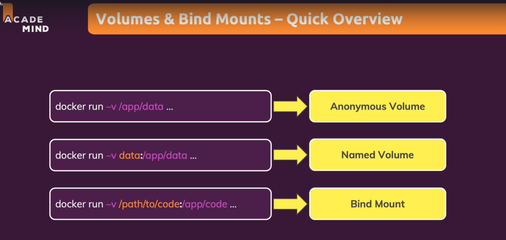
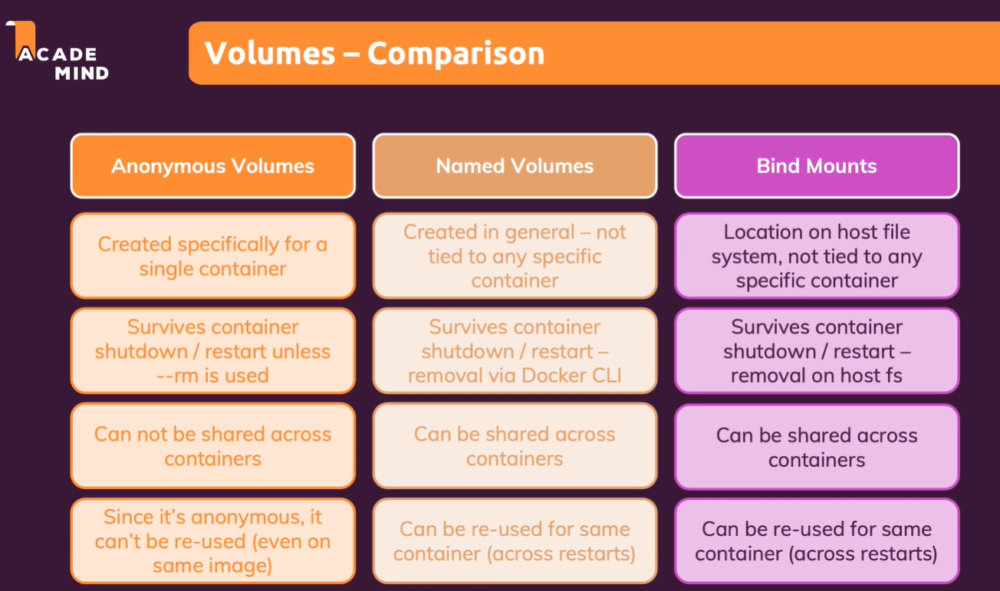

### Volumes 
    -- A built-in feature of docker.
    -- Filesystem on the host machine which are mounted/mapped to the container.
    -- It persists even if container gets deleted.


#### Anonymous Volumes

    To create an anonymous volume, we need to mention it in the dockerfile

```
    VOLUME [ " directory which should de made persist”]
    Ex:
    VOLUME [“/app/db”]
```

    -- Location of the storage on host machine gets decided by the docker.
    -- These volumes gets deleted once the container is deleted.


#### Named Volumes

    -- They are persisted even after container deletion.
    -- We cannot access it directly on the host machine.

To create a named volume, while starting the container we provide arguments to the command.

`-v volume-name:path-inside-container`

#### Bind mounts

    -- User or developer define the path of the volume on the host machine
    -- If we put our source code inside the bind mount location then we can change them even if the container is running, without rebuilding the image.


<strong>How to create bind mounts?</strong>

`-v <absolute path of the location on host machine>:<location on docker container>`

We should ensure that docker has access to the path on host machine.

```
To get absolute paths:

macOS / Linux: -v $(pwd):/app
Windows: -v "%cd%":/app
```

If we want to create a bind mount read only i.e, the containers can only read the files on our host not write on it then we add `:ro` at the end of the bind mount definition
Ex: `-v <absolute path of the location on host machine>:<location on docker container>:ro`

When we bind mount a volume during the container run, all the operations done inside the app directory of the container becomes invalid.
```
Ex: When we run requirement file during the image creation and suppose it creates some files inside the app directory. Now, when we create a container with bind mount to app directory. All the files gets missing.
```

One way to preserve the files created during image build is to create an `anonymous volumes` along with the bind mounts which will mount the specific directories required to preserve.

```
Ex: `-v /app/node_modules`
==> We can create anonymous volumes from the command line like this.
==> Here node_modules which got installed during the image creation are preserved.
```





